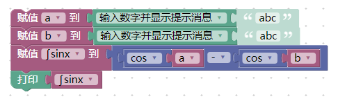
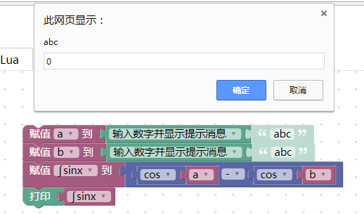
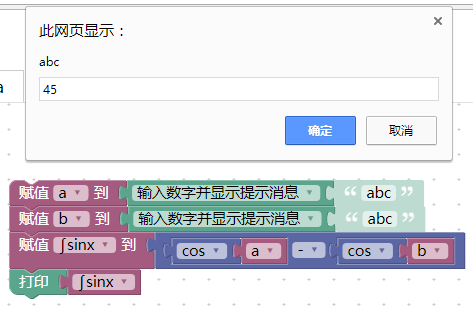

# 个人案例汇总

---

## 项磊磊

#### 案例名称：猜猜看是几？

这是一个游戏的案例，在平常我们聚会时，我们通常会玩一个游戏：首先，一个人输入一个数字，大家一块去猜，如果数字小了，那么主持人就会提示小了；如果数字大了，那么主持人提示大了。直到我们猜中这个数字。  
这就是这样一个案例，首先展示下它的拼接好的模块图  
  
下面来运行。首先，我们设定一个数字25  
  
我们来猜26  
  
结果呢？多了。  
  
我们再猜24  
  
结果少了  
  
最后，我们输入25  
  
来看看  
  
答案正确了。所以下次和朋友聚餐时，可以玩一下试试。

#### JavaScript码
```
var a, b;

b = window.prompt\('请设定数字'\);  
while \(!\(a == b\)\) {  
  a = parseFloat\(window.prompt\('猜猜看'\)\);  
  if \(a &lt; b\) {  
    window.alert\('小'\);  
  } else if \(a &gt; b\) {  
    window.alert\('大'\);  
  }  
}  
window.alert\('Bingo'\);
```
#### XML代码
```
<xml xmlns="http://www.w3.org/1999/xhtml">
  <variables>
    <variable type="" id="SM2_RJEIkiMTOE$kpPcA">a</variable>
    <variable type="" id="5IM(6tU44P%,W!zdb:~$">b</variable>
  </variables>
  <block type="variables_set" id="$)yY@y/rRKpfvWGc!rV@" x="163" y="63">
    <field name="VAR" id="5IM(6tU44P%,W!zdb:~$" variabletype="">b</field>
    <value name="VALUE">
      <block type="text_prompt_ext" id="~eCmk.72eyu!cpu-Sf,O">
        <mutation type="TEXT"></mutation>
        <field name="TYPE">TEXT</field>
        <value name="TEXT">
          <shadow type="text" id="qu3Pt2A(5OH=qf{fVd]Y">
            <field name="TEXT">please set a number of 0 to 100</field>
          </shadow>
        </value>
      </block>
    </value>
    <next>
      <block type="controls_whileUntil" id=";==W__o~(1}TP=uz2PqQ">
        <field name="MODE">UNTIL</field>
        <value name="BOOL">
          <block type="logic_compare" id="@){N_!!-!K(ZL(pWEz$b">
            <field name="OP">EQ</field>
            <value name="A">
              <block type="variables_get" id="`,k/r:`$MN5^Fakj4ty!">
                <field name="VAR" id="SM2_RJEIkiMTOE$kpPcA" variabletype="">a</field>
              </block>
 </value>
            <value name="B">
              <block type="variables_get" id="zkwic?GKfYtA}Bba]BCS">
                <field name="VAR" id="5IM(6tU44P%,W!zdb:~$" variabletype="">b</field>
              </block>
            </value>
          </block>
        </value>
        <statement name="DO">
          <block type="variables_set" id="qfR:wN_.I)JFYPpq`y]/">
            <field name="VAR" id="SM2_RJEIkiMTOE$kpPcA" variabletype="">a</field>
            <value name="VALUE">
              <block type="text_prompt_ext" id="H.5Wkd5IIzzil4Jm$5_p">
                <mutation type="TEXT"></mutation>
                <field name="TYPE">TEXT</field>
                <value name="TEXT">
                  <shadow type="text" id="s}^))-7B82^RrF)`}^H@">
                    <field name="TEXT">take a guess</field>
                  </shadow>
                </value>
              </block>
            </value>
            <next>
              <block type="controls_if" id="5K]lTHT=D9WHtrVp[_LY">
                <mutation elseif="1"></mutation>
                <value name="IF0">
                  <block type="logic_compare" id="ZYoKfLLaqyTjPAgc3s1(">
                    <field name="OP">LT</field>
                    <value name="A">
                      <block type="variables_get" id="q@KTUdRh}.JD25?8f#`B">
                        <field name="VAR" id="SM2_RJEIkiMTOE$kpPcA" variabletype="">a</field>
                      </block>
                    </value>
                    <value name="B">
                      <block type="variables_get" id="XX5vnzEcKFHUFJi`;Quh">
                        <field name="VAR" id="5IM(6tU44P%,W!zdb:~$" variabletype="">b</field>
                      </block>
                    </value>
                  </block>
                </value>
                <statement name="DO0">
                  <block type="text_print" id="d#EG6jTQt^RE4VkM|%`W">
                    <value name="TEXT">
                      <shadow type="text" id="E!XiSmx(sMIj*!pBC.Xz">
                        <field name="TEXT">less</field>
                      </shadow>
                    </value>
                  </block>
                </statement>
                <value name="IF1">
                  <block type="logic_compare" id="Q%`;W.mu,@uxBGrf],+?">
                    <field name="OP">GT</field>
                    <value name="A">
                      <block type="variables_get" id="Yq}Imn6RsWHU,%N,TW!c">
                        <field name="VAR" id="SM2_RJEIkiMTOE$kpPcA" variabletype="">a</field>
                      </block>
                    </value>
                    <value name="B">
                      <block type="variables_get" id="fF|{t`~G@;F;9%ulS+]7">
                        <field name="VAR" id="5IM(6tU44P%,W!zdb:~$" variabletype="">b</field>
                      </block>
                    </value>
                  </block>
                </value>
                <statement name="DO1">
                  <block type="text_print" id="#O$LEi,bljpRU,P!^G_H">
                    <value name="TEXT">
                      <shadow type="text" id="PL9AF-*XiRlGcdU=W(Kp">
                        <field name="TEXT">more</field>
                      </shadow>
                    </value>
                  </block>
                </statement>
              </block>
            </next>
          </block>
        </statement>
        <next>
          <block type="text_print" id="6#hP,WEbP;;Ocv0!;N??">
            <value name="TEXT">
              <shadow type="text" id="^`#h|n^PFddlRTfg`[v|">
                <field name="TEXT">Bingo</field>
              </shadow>
            </value>
          </block>
        </next>
      </block>
    </next>
  </block>
</xml>

```
---
##肖云宿
####案例名称：sinx的积分
  
该案例用于计算sinx 的积分，输入a、b（角度制）便可得到sinx的积分结果，一下是运行过程及结果：  
首先输入a为0度  
   
再输入b为45度  
   
得出结果：  
   
####XML代码
```
<xml xmlns="http://www.w3.org/1999/xhtml">
  <variables>
    <variable type="" id="@JYk)Ht0MhKTTgL9Was$">赋值</variable>
    <variable type="" id="M;7eDV8J4R*79F)~~My*">x</variable>
    <variable type="" id="iS@ye,(;3Md0@{`2Aidw">a</variable>
    <variable type="" id="Rc;Ryn#(}Utt%~rlwmgW">b</variable>
    <variable type="" id=":?#?:pi?aC5bs/JHG(ko">π</variable>
    <variable type="" id="^%WZONX=i.IS}azlU(=_">s</variable>
    <variable type="" id="m{jR-tc]i40GnB`uaxNw">∫sinx</variable>
  </variables>
  <block type="variables_set" id="M#CNnF0V;)i/-7ZBQh^X" x="238" y="188">
    <field name="VAR" id="iS@ye,(;3Md0@{`2Aidw" variabletype="">a</field>
    <value name="VALUE">
      <block type="text_prompt_ext" id="mLZSK;k$0_BoZ0ya2k2C">
        <mutation type="NUMBER"></mutation>
        <field name="TYPE">NUMBER</field>
        <value name="TEXT">
          <shadow type="text" id="fSSJc*-ixJ#/$+(e}23]">
            <field name="TEXT">abc</field>
          </shadow>
        </value>
      </block>
    </value>
    <next>
      <block type="variables_set" id="(@Nt53fBR!x;JXDoYPaA">
        <field name="VAR" id="Rc;Ryn#(}Utt%~rlwmgW" variabletype="">b</field>
        <value name="VALUE">
          <block type="text_prompt_ext" id="]wRC@VhW,r]HMSQ`q1au">
            <mutation type="NUMBER"></mutation>
            <field name="TYPE">NUMBER</field>
            <value name="TEXT">
              <shadow type="text" id="^[$Kj_/zh{}l}`%WugY7">
                <field name="TEXT">abc</field>
              </shadow>
            </value>
          </block>
        </value>
        <next>
          <block type="variables_set" id="_07$tJ7$MY-2nhDt9oJ.">
            <field name="VAR" id="m{jR-tc]i40GnB`uaxNw" variabletype="">∫sinx</field>
            <value name="VALUE">
              <block type="math_arithmetic" id="F_Q:,laKX{@gtF~YsE}D">
                <field name="OP">MINUS</field>
                <value name="A">
                  <shadow type="math_number" id="nYWy^9g{,1r9Ib;^%ebm">
                    <field name="NUM">1</field>
                  </shadow>
                  <block type="math_trig" id="=4l$,a1Hv2x)-|zWvO@e">
                    <field name="OP">COS</field>
                    <value name="NUM">
                      <shadow type="math_number" id="J6d21*RpxrWubab@lCdQ">
                        <field name="NUM">45</field>
                      </shadow>
                      <block type="variables_get" id="2xnxfMF#,QkkPI)fL}2k">
                        <field name="VAR" id="iS@ye,(;3Md0@{`2Aidw" variabletype="">a</field>
                      </block>
                    </value>
                  </block>
                </value>
                <value name="B">
                  <shadow type="math_number" id="j=+X^1SUu_Y*AP),4]^E">
                    <field name="NUM">1</field>
                  </shadow>
                  <block type="math_trig" id="#]T})HW};P%R5Mi/m74!">
                    <field name="OP">COS</field>
                    <value name="NUM">
                      <shadow type="math_number" id="680KbN|VSQvQwemKI+lO">
                        <field name="NUM">45</field>
                      </shadow>
                      <block type="variables_get" id="nb(v.._|w4R|]$S7ulcL">
                        <field name="VAR" id="Rc;Ryn#(}Utt%~rlwmgW" variabletype="">b</field>
                      </block>
                    </value>
                  </block>
                </value>
              </block>
            </value>
            <next>
              <block type="text_print" id="95+RSZxn2fCWabObEX.D">
                <value name="TEXT">
                  <shadow type="text" id="lwq2zSpk.G4P{=~nW26x">
                    <field name="TEXT">abc</field>
                  </shadow>
                  <block type="variables_get" id="pWc8sS~2*mCqKI7^u=QJ">
                    <field name="VAR" id="m{jR-tc]i40GnB`uaxNw" variabletype="">∫sinx</field>
                  </block>
                </value>
              </block>
            </next>
          </block>
        </next>
      </block>
    </next>
  </block>
</xml>

```

---
#吴思睿
####案例名称：
####XML代码
---
#吴铠岚
####案例名称：
####XML代码

---
#武山权
####案例名称：
####XML代码

---
#夏及皓
####案例名称：
####XML代码

---
#吴思清
####案例名称：
####XML代码
```
<xml xmlns="http://www.w3.org/1999/xhtml">
  <variables>
    <variable type="" id="THV2OY9]jyBXk1Zdd+(!">i</variable>
    <variable type="" id="~o|iSzP9G9p-jV#m/./f">初始年</variable>
    <variable type="" id="^MWItA~K?KcL[@WC*RqF">结束年</variable>
    <variable type="" id="3},2=WuP{PJ3^SDYFP8f">n</variable>
    <variable type="" id="3NirR^N_nubOgat4t:Zs">列表</variable>
    <variable type="" id="K/{yqj,@E6[z(f1hD`MY">初始月</variable>
    <variable type="" id="5ndN#Gu95x5?5yR7$8+=">初始日</variable>
    <variable type="" id="b3FofX!YI_DQ/1!81l=)">结束月</variable>
    <variable type="" id="J0{oq7dN|e?1uYpyPimy">结束日</variable>
    <variable type="" id="G{MB~H%b}qY(XxQ=63YE">m</variable>
    <variable type="" id="lo%KRgT-L$S]OIpUReDy">天数</variable>
    <variable type="" id="=hD9yQ4eWTWMlM3e#*qW">总共天数</variable>
    <variable type="" id="JZ6|xbJ^EmQ,)vKREzTT">初始年天数</variable>
    <variable type="" id="AHuJGJ[_R%g^(f3S{8Xs">结束年天数</variable>
    <variable type="" id="IDI0O}_16p)T#k@1RI,i">P</variable>
    <variable type="" id=":xDM{V+Ad0VT2eK/Z[+?">Q</variable>
  </variables>
  <block type="variables_set" id="hwFXyOMRl+2H0E28C6(x" x="-612" y="-87">
    <field name="VAR" id="~o|iSzP9G9p-jV#m/./f" variabletype="">初始年</field>
    <value name="VALUE">
      <block type="text_prompt_ext" id="d-wo*[7D2Xjk7EYmzL%m">
        <mutation type="NUMBER"></mutation>
        <field name="TYPE">NUMBER</field>
        <value name="TEXT">
          <shadow type="text" id="O*b5F7Twf(,GJHslwB`9">
            <field name="TEXT">初始年</field>
          </shadow>
        </value>
      </block>
    </value>
    <next>
      <block type="variables_set" id="*NfOwCM*dvG/[Z$I`#0f">
        <field name="VAR" id="K/{yqj,@E6[z(f1hD`MY" variabletype="">初始月</field>
        <value name="VALUE">
          <block type="text_prompt_ext" id="u_!u(Aa@XC{hUo#3Isha">
            <mutation type="NUMBER"></mutation>
            <field name="TYPE">NUMBER</field>
            <value name="TEXT">
              <shadow type="text" id="DavA9(?];Q#-C|xsqmSf">
                <field name="TEXT">初始月</field>
              </shadow>
            </value>
          </block>
        </value>
        <next>
          <block type="variables_set" id="3yU]NJjx2/!GNR)N5Z8C">
            <field name="VAR" id="5ndN#Gu95x5?5yR7$8+=" variabletype="">初始日</field>
            <value name="VALUE">
              <block type="text_prompt_ext" id="/Lp82s`6@.qdP0rE42wu">
                <mutation type="NUMBER"></mutation>
                <field name="TYPE">NUMBER</field>
                <value name="TEXT">
                  <shadow type="text" id="rTqa@o!:hI^QpIr,uF;/">
                    <field name="TEXT">初始日</field>
                  </shadow>
                </value>
              </block>
            </value>
            <next>
              <block type="variables_set" id="}M+E$)5/2@$zs$|=0)xD">
                <field name="VAR" id="^MWItA~K?KcL[@WC*RqF" variabletype="">结束年</field>
                <value name="VALUE">
                  <block type="text_prompt_ext" id="!#*8+V=1Da%3U(Lurxtu">
                    <mutation type="NUMBER"></mutation>
                    <field name="TYPE">NUMBER</field>
                    <value name="TEXT">
                      <shadow type="text" id="_IWwYyylPH9)r^*+|TMd">
                        <field name="TEXT">结束年</field>
                      </shadow>
                    </value>
                  </block>
                </value>
                <next>
                  <block type="variables_set" id="P}!sJ%y|TzOg3ig;mKTy">
                    <field name="VAR" id="b3FofX!YI_DQ/1!81l=)" variabletype="">结束月</field>
                    <value name="VALUE">
                      <block type="text_prompt_ext" id="NYAJ!31g.B~|rvWNaUL}">
                        <mutation type="NUMBER"></mutation>
                        <field name="TYPE">NUMBER</field>
                        <value name="TEXT">
                          <shadow type="text" id="xa^1Fw`8?9gx$O~y4kvh">
                            <field name="TEXT">结束月</field>
                          </shadow>
                        </value>
                      </block>
                    </value>
                    <next>
                      <block type="variables_set" id="AzFXZ^HJEbXcA)J{MUSF">
                        <field name="VAR" id="J0{oq7dN|e?1uYpyPimy" variabletype="">结束日</field>
                        <value name="VALUE">
                          <block type="text_prompt_ext" id=";:`n5sihfO,Dq#PycTk%">
                            <mutation type="NUMBER"></mutation>
                            <field name="TYPE">NUMBER</field>
                            <value name="TEXT">
                              <shadow type="text" id="lbn*3~+x/fXoiF*$qGpn">
                                <field name="TEXT">结束日</field>
                              </shadow>
                            </value>
                          </block>
                        </value>
                        <next>
                          <block type="variables_set" id="#p|1jb_R9MYnNW4U9aN(">
                            <field name="VAR" id="3},2=WuP{PJ3^SDYFP8f" variabletype="">n</field>
                            <value name="VALUE">
                              <block type="math_number" id="P_#T1G*dT;]!HBhEC2?|">
                                <field name="NUM">0</field>
                              </block>
                            </value>
                            <next>
                              <block type="variables_set" id="=ZY_~2iIXJ!e*Mx|db9Y">
                                <field name="VAR" id="lo%KRgT-L$S]OIpUReDy" variabletype="">天数</field>
                                <value name="VALUE">
                                  <block type="lists_create_with" id="8}M_)4.(3+}8TA)3is5R">
                                    <mutation items="12"></mutation>
                                    <value name="ADD0">
                                      <block type="math_number" id="5fun=NQY2k[Ai4;Cl#uP">
                                        <field name="NUM">31</field>
                                      </block>
                                    </value>
                                    <value name="ADD1">
                                      <block type="math_number" id="l2)6Rz}1kqWYQgCxWJ0c">
                                        <field name="NUM">28</field>
                                      </block>
                                    </value>
                                    <value name="ADD2">
                                      <block type="math_number" id="9wJfc7i(4jmG9e~R5+9j">
                                        <field name="NUM">31</field>
                                      </block>
                                    </value>
                                    <value name="ADD3">
                                      <block type="math_number" id="z)S;w[;fY1hxOSp0-0d{">
                                        <field name="NUM">30</field>
                                      </block>
                                    </value>
                                    <value name="ADD4">
                                      <block type="math_number" id="IKiV(08?|s~](!7Q_@B~">
                                        <field name="NUM">31</field>
                                      </block>
                                    </value>
                                    <value name="ADD5">
                                      <block type="math_number" id="zwrM`lR}dk+:k`fhSPa~">
                                        <field name="NUM">30</field>
                                      </block>
                                    </value>
                                    <value name="ADD6">
                                      <block type="math_number" id="V`mbfpQ.D_DK~Tt;e0^_">
                                        <field name="NUM">31</field>
                                      </block>
                                    </value>
                                    <value name="ADD7">
                                      <block type="math_number" id="#!w2x3@p_[O|6DK]QP]~">
                                        <field name="NUM">31</field>
                                      </block>
                                    </value>
                                    <value name="ADD8">
                                      <block type="math_number" id="Sqj+1VT*`SU|/ycv2NPR">
                                        <field name="NUM">30</field>
                                      </block>
                                    </value>
                                    <value name="ADD9">
                                      <block type="math_number" id="SzJU8lx4#iK[v/|HE6f.">
                                        <field name="NUM">31</field>
                                      </block>
                                    </value>
                                    <value name="ADD10">
                                      <block type="math_number" id="f5$5*^ixU3YQxP-o2/[E">
                                        <field name="NUM">30</field>
                                      </block>
                                    </value>
                                    <value name="ADD11">
                                      <block type="math_number" id="eeIsKACg4A3/B.:lrl)C">
                                        <field name="NUM">31</field>
                                      </block>
                                    </value>
                                  </block>
                                </value>
                                <next>
                                  <block type="controls_if" id="QSgwi]r;)Me|uxteA,MC">
                                    <mutation else="1"></mutation>
                                    <value name="IF0">
                                      <block type="logic_compare" id="cEvFVBPrd{9xIWb|Z`w`">
                                        <field name="OP">EQ</field>
                                        <value name="A">
                                          <block type="variables_get" id=")Jlp)!,WL$K2/h}WYgfu">
                                            <field name="VAR" id="K/{yqj,@E6[z(f1hD`MY" variabletype="">初始月</field>
                                          </block>
                                        </value>
                                        <value name="B">
                                          <block type="math_number" id="!%e?,JM0SWpTSUVA)5UJ">
                                            <field name="NUM">12</field>
                                          </block>
                                        </value>
                                      </block>
                                    </value>
                                    <statement name="DO0">
                                      <block type="variables_set" id="-~c,fY|wJa{TYB.i$d#{">
                                        <field name="VAR" id="JZ6|xbJ^EmQ,)vKREzTT" variabletype="">初始年天数</field>
                                        <value name="VALUE">
                                          <block type="math_arithmetic" id="2:HozMQIuKmtRH~]d$Kz">
                                            <field name="OP">MINUS</field>
                                            <value name="A">
                                              <shadow type="math_number" id="qjhA]IX`?k1+h$rH=bXk">
                                                <field name="NUM">31</field>
                                              </shadow>
                                            </value>
                                            <value name="B">
                                              <shadow type="math_number" id="A)kNE52jE]o41?a+p@C?">
                                                <field name="NUM">1</field>
                                              </shadow>
 <block type="variables_get" id="*vRL_i~|Vj4zeS[7B,^c">
                                                <field name="VAR" id="5ndN#Gu95x5?5yR7$8+=" variabletype="">初始日</field>
                                              </block>
                                            </value>
                                          </block>
                                        </value>
                                      </block>
                                    </statement>
                                    <statement name="ELSE">
                                      <block type="variables_set" id="k:6mK-|ZHm@T*eHeok]R">
                                        <field name="VAR" id="JZ6|xbJ^EmQ,)vKREzTT" variabletype="">初始年天数</field>
                                        <value name="VALUE">
                                          <block type="math_arithmetic" id="Y|11}u(Z1[4Ul3kJAe4/">
                                            <field name="OP">ADD</field>
                                            <value name="A">
                                              <shadow type="math_number" id="rpz#k8kVp65fMlPRtheg">
                                                <field name="NUM">1</field>
                                              </shadow>
                                              <block type="math_on_list" id="s$|Na1+IZW?Wx=D8,g-K">
                                                <mutation op="SUM"></mutation>
                                                <field name="OP">SUM</field>
                                                <value name="LIST">
                                                  <block type="lists_getSublist" id="?e9q|F-TiO.cif8@[$E1">
                                                    <mutation at1="true" at2="false"></mutation>
                                                    <field name="WHERE1">FROM_START</field>
                                                    <field name="WHERE2">LAST</field>
                                                    <value name="LIST">
                                                      <block type="variables_get" id="I#Agak,^`#eZD8F`ekVt">
                                                        <field name="VAR" id="lo%KRgT-L$S]OIpUReDy" variabletype="">天数</field>
                                                      </block>
                                                    </value>
                                                    <value name="AT1">
                                                      <block type="math_arithmetic" id=";AB#*YS,M}P=`0SLy@SS">
                                                        <field name="OP">ADD</field>
                                                        <value name="A">
                                                          <shadow type="math_number" id="s,|-+=M0Nptl$5WgM9E|">
                                                            <field name="NUM">1</field>
                                                          </shadow>
                                                          <block type="variables_get" id="aQ5p/}$VJoBD_gUlF9,h">
                                                            <field name="VAR" id="K/{yqj,@E6[z(f1hD`MY" variabletype="">初始月</field>
                                                          </block>
                                                        </value>
                                                        <value name="B">
                                                          <shadow type="math_number" id="*?1/2RQPe;#5-dO4?7M$">
                                                            <field name="NUM">1</field>
                                                          </shadow>
                                                        </value>
                                                      </block>
                                                    </value>
                                                  </block>
                                                </value>
                                              </block>
                                            </value>
                                            <value name="B">
                                              <shadow type="math_number" id="[(W51bUT}bCPnmo2A4ns">
                                                <field name="NUM">1</field>
                                              </shadow>
                                              <block type="math_arithmetic" id=")J|g@4M4L@TJsE?,|}XT">
                                                <field name="OP">MINUS</field>
                                                <value name="A">
                                                  <shadow type="math_number" id="_|9Z+%0z%x6vMSybK:T`">
                                                    <field name="NUM">1</field>
                                                  </shadow>
                                                  <block type="lists_getIndex" id="`0CO/5_lTOuQ%z7DN?[`">
                                                    <mutation statement="false" at="true"></mutation>
                                                    <field name="MODE">GET</field>
                                                    <field name="WHERE">FROM_START</field>
                                                    <value name="VALUE">
                                                      <block type="variables_get" id="_7F/i`L(H]`dI5b6(yQ;">
                                                        <field name="VAR" id="lo%KRgT-L$S]OIpUReDy" variabletype="">天数</field>
                                                      </block>
                                                    </value>
                                                    <value name="AT">
                                                      <block type="variables_get" id="e{lx!nXDs[{6SSNtdyxT">
                                                        <field name="VAR" id="K/{yqj,@E6[z(f1hD`MY" variabletype="">初始月</field>
                                                      </block>
                                                    </value>
                                                  </block>
                                                </value>
                                                <value name="B">
                                                  <shadow type="math_number" id="bnL.XM9OfOF/F`].jMh:">
                                                    <field name="NUM">1</field>
                                                  </shadow>
                                                  <block type="variables_get" id=";;NXoh-q!|TwMmkfv,$[">
                                                    <field name="VAR" id="5ndN#Gu95x5?5yR7$8+=" variabletype="">初始日</field>
                                                  </block>
                                                </value>
                                              </block>
                                            </value>
                                          </block>
                                        </value>
                                      </block>
                                    </statement>
                                    <next>
                                      <block type="controls_if" id="1Jj}?gzhYc_rIG31Zj_-">
                                        <mutation else="1"></mutation>
                                        <value name="IF0">
                                          <block type="logic_compare" id="#E6WVDqzF;ubPK=64Du%">
                                            <field name="OP">EQ</field>
                                            <value name="A">
                                              <block type="variables_get" id="3K]U8PV}z=cn6X^INjBj">
                                                <field name="VAR" id="b3FofX!YI_DQ/1!81l=)" variabletype="">结束月</field>
                                              </block>
                                            </value>
                                            <value name="B">
                                              <block type="math_number" id="X%`y8V,,K4AUU,#,@+LX">
                                                <field name="NUM">1</field>
                                              </block>
                                            </value>
                                          </block>
                                        </value>
                                        <statement name="DO0">
                                          <block type="variables_set" id="wg$QL`:o?GkaG=s1T:G2">
                                            <field name="VAR" id="AHuJGJ[_R%g^(f3S{8Xs" variabletype="">结束年天数</field>
                                            <value name="VALUE">
                                              <block type="variables_get" id="yFACWhgd!,/v]S)m9/~^">
                                                <field name="VAR" id="J0{oq7dN|e?1uYpyPimy" variabletype="">结束日</field>
                                              </block>
                                            </value>
                                          </block>
                                        </statement>
                                        <statement name="ELSE">
                                          <block type="variables_set" id="a_f9!;=)q!/Y1[N/uMpa">
                                            <field name="VAR" id="AHuJGJ[_R%g^(f3S{8Xs" variabletype="">结束年天数</field>
                                            <value name="VALUE">
                                              <block type="math_arithmetic" id="1YMn!V=M[WJh|2[=;/2%">
                                                <field name="OP">ADD</field>
                                                <value name="A">
                                                  <shadow type="math_number" id="rpz#k8kVp65fMlPRtheg">
                                                    <field name="NUM">1</field>
                                                  </shadow>
                                                  <block type="math_on_list" id="cEA@JZ!sCG]=idoA_g`;">
                                                    <mutation op="SUM"></mutation>
                                                    <field name="OP">SUM</field>
                                                    <value name="LIST">
                                                      <block type="lists_getSublist" id="g1evZ{e`;(~7.UJV3hiT">
                                                        <mutation at1="false" at2="true"></mutation>
                                                        <field name="WHERE1">FIRST</field>
                                                        <field name="WHERE2">FROM_START</field>
                                                        <value name="LIST">
                                                          <block type="variables_get" id="M9{4uF]foSV]$?2Z-K$Z">
                                                            <field name="VAR" id="lo%KRgT-L$S]OIpUReDy" variabletype="">天数</field>
                                                          </block>
                                                        </value>
                                                        <value name="AT2">
                                                          <block type="math_arithmetic" id="@W;yACw=1!oLBg/fI[Be">
                                                            <field name="OP">MINUS</field>
                                                            <value name="A">
                                                              <shadow type="math_number" id="s,|-+=M0Nptl$5WgM9E|">
                                                                <field name="NUM">1</field>
                                                              </shadow>
                                                              <block type="variables_get" id="p|=?e0L^MAAr;:[X^T}X">
                                                                <field name="VAR" id="b3FofX!YI_DQ/1!81l=)" variabletype="">结束月</field>
                                                              </block>
                                                            </value>
                                                            <value name="B">
                                                              <shadow type="math_number" id=".]SRG{,JiVeJ{0OMR4Y1">
                                                                <field name="NUM">1</field>
                                                              </shadow>
                                                            </value>
                                                          </block>
                                                        </value>
                                                      </block>
                                                    </value>
                                                  </block>
                                                </value>
                                                <value name="B">
                                                  <shadow type="math_number" id="[(W51bUT}bCPnmo2A4ns">
                                                    <field name="NUM">1</field>
                                                  </shadow>
                                                  <block type="variables_get" id="y{LY+m6IclOEVG@ThXEn">
                                                    <field name="VAR" id="J0{oq7dN|e?1uYpyPimy" variabletype="">结束日</field>
                                                  </block>
                                                </value>
                                              </block>
                                            </value>
                                          </block>
                                        </statement>
                                        <next>
                                          <block type="controls_if" id="6+a0%nrDf)xW182%fe!L">
                                            <mutation else="1"></mutation>
                                            <value name="IF0">
                                              <block type="math_number_property" id="Pwh{}z)hZjwpL`}%aPfI">
                                                <mutation divisor_input="false"></mutation>
                                                <field name="PROPERTY">WHOLE</field>
                                                <value name="NUMBER_TO_CHECK">
                                                  <shadow type="math_number" id="l1/aN{$1|om9t~s~g5lw">
                                                    <field name="NUM">0</field>
                                                  </shadow>
                                                  <block type="math_arithmetic" id="#EE-fK#y}|Zk./9OeL9U">
                                                    <field name="OP">DIVIDE</field>
                                                    <value name="A">
                                                      <shadow type="math_number" id="cDO/U%+ePC!tZhG1X|^;">
                                                        <field name="NUM">1</field>
                                                      </shadow>
                                                      <block type="variables_get" id="U/)q:37r~P9r|2n3#o##">
                                                        <field name="VAR" id="~o|iSzP9G9p-jV#m/./f" variabletype="">初始年</field>
                                                      </block>
                                                    </value>
                                                    <value name="B">
   <shadow type="math_number" id="dYG{Cm5AAl|TsvL6f6ru">
                                                        <field name="NUM">100</field>
                                                      </shadow>
                                                    </value>
                                                  </block>
                                                </value>
                                              </block>
                                            </value>
                                            <statement name="DO0">
                                              <block type="controls_if" id="AE5l]Xw_z[^?W)QGx^,`">
                                                <mutation else="1"></mutation>
                                                <value name="IF0">
                                                  <block type="math_number_property" id="}fO`AHv7*xz^.Q^=!pp]">
                                                    <mutation divisor_input="false"></mutation>
                                                    <field name="PROPERTY">WHOLE</field>
                                                    <value name="NUMBER_TO_CHECK">
                                                      <shadow type="math_number" id="l1/aN{$1|om9t~s~g5lw">
                                                        <field name="NUM">0</field>
                                                      </shadow>
                                                      <block type="math_arithmetic" id="{M`dx6no/Xq8$.!igdR2">
                                                        <field name="OP">DIVIDE</field>
                                                        <value name="A">
                                                          <shadow type="math_number" id="~oGWG:#4dz?8a^7yd{1J">
                                                            <field name="NUM">1</field>
                                                          </shadow>
                                                          <block type="variables_get" id="Y0sV-NqilN8I(=HKia8N">
                                                            <field name="VAR" id="~o|iSzP9G9p-jV#m/./f" variabletype="">初始年</field>
                                                          </block>
                                                        </value>
                                                        <value name="B">
                                                          <shadow type="math_number" id="iSM8s0ub[?XEh+De:4+|">
                                                            <field name="NUM">400</field>
                                                          </shadow>
                                                        </value>
                                                      </block>
                                                    </value>
                                                  </block>
                                                </value>
                                                <statement name="DO0">
                                                  <block type="controls_if" id="dF0r1Hf[Eo]/mD^Wu-Y?">
                                                    <mutation else="1"></mutation>
                                                    <value name="IF0">
                                                      <block type="logic_operation" id="^}pjl%A06}v{{LNFBz)?">
                                                        <field name="OP">AND</field>
                                                        <value name="A">
                                                          <block type="logic_compare" id="MZk(R+HI8y8H#:)KEBB6">
                                                            <field name="OP">GT</field>
                                                            <value name="A">
                                                              <block type="variables_get" id="p=uWq!RCk/@o@aq7(g.c">
                                                                <field name="VAR" id="K/{yqj,@E6[z(f1hD`MY" variabletype="">初始月</field>
                                                              </block>
                                                            </value>
                                                            <value name="B">
                                                              <block type="math_number" id=",IYS*8q3gMqpRMU]pMKd">
                                                                <field name="NUM">2</field>
                                                              </block>
                                                            </value>
                                                          </block>
                                                        </value>
                                                        <value name="B">
                                                          <block type="logic_compare" id="BVJY:}PtRdTzz@$%O$8~">
                                                            <field name="OP">LTE</field>
                                                            <value name="A">
                                                              <block type="variables_get" id="4-q}vWQm0.C@MC+Rq[Q5">
                                                                <field name="VAR" id="K/{yqj,@E6[z(f1hD`MY" variabletype="">初始月</field>
                                                              </block>
                                                            </value>
                                                            <value name="B">
                                                              <block type="math_number" id="z[*^~sx~7jRqy6P!H4*|">
                                                                <field name="NUM">12</field>
                                                              </block>
                                                            </value>
                                                          </block>
                                                        </value>
                                                      </block>
                                                    </value>
                                                    <statement name="DO0">
                                                      <block type="variables_set" id="85a]QB+-l#Hk:QNhNZ^`">
                                                        <field name="VAR" id="IDI0O}_16p)T#k@1RI,i" variabletype="">P</field>
                                                        <value name="VALUE">
                                                          <block type="variables_get" id="HoKL=T8Qu=4LWhoMdJ}l">
                                                            <field name="VAR" id="JZ6|xbJ^EmQ,)vKREzTT" variabletype="">初始年天数</field>
                                                          </block>
                                                        </value>
                                                      </block>
                                                    </statement>
                                                    <statement name="ELSE">
                                                      <block type="variables_set" id="Bj*8Zrx]TEqW1X?kM_sz">
                                                        <field name="VAR" id="IDI0O}_16p)T#k@1RI,i" variabletype="">P</field>
                                                        <value name="VALUE">
                                                          <block type="math_arithmetic" id=")+m^R=k2h@fMaH?-/s;2">
                                                            <field name="OP">ADD</field>
                                                            <value name="A">
                                                              <shadow type="math_number" id="Vb!-=*@,!_)%GUdMu4-W">
                                                                <field name="NUM">1</field>
                                                              </shadow>
                                                              <block type="variables_get" id="I~4JLj[Go]iGL6``+~n(">
                                                                <field name="VAR" id="JZ6|xbJ^EmQ,)vKREzTT" variabletype="">初始年天数</field>
                                                              </block>
                                                            </value>
                                                            <value name="B">
                                                              <shadow type="math_number" id="NcZ~IE.CpN5Z$d#4PLO0">
                                                                <field name="NUM">1</field>
                                                              </shadow>
                                                            </value>
                                                          </block>
                                                        </value>
                                                      </block>
                                                    </statement>
                                                  </block>
                                                </statement>
                                                <statement name="ELSE">
                                                  <block type="variables_set" id="ZVMEO2S8{~7REqsCH0-n">
                                                    <field name="VAR" id="IDI0O}_16p)T#k@1RI,i" variabletype="">P</field>
                                                    <value name="VALUE">
                                                      <block type="variables_get" id="}SX]T}WS~X^OjVrsgbaG">
                                                        <field name="VAR" id="JZ6|xbJ^EmQ,)vKREzTT" variabletype="">初始年天数</field>
                                                      </block>
                                                    </value>
                                                  </block>
                                                </statement>
                                              </block>
                                            </statement>
                                            <statement name="ELSE">
                                              <block type="controls_if" id="fGKQX8S/{}6U[o{/;!G=">
                                                <mutation else="1"></mutation>
                                                <value name="IF0">
                                                  <block type="math_number_property" id="$*G||=g+vkhWHA*~.tyz">
                                                    <mutation divisor_input="false"></mutation>
                                                    <field name="PROPERTY">WHOLE</field>
                                                    <value name="NUMBER_TO_CHECK">
                                                      <shadow type="math_number" id="l1/aN{$1|om9t~s~g5lw">
                                                        <field name="NUM">0</field>
                                                      </shadow>
                                                      <block type="math_arithmetic" id="*OvIj8Mip|b]Oa}?;+{g">
                                                        <field name="OP">DIVIDE</field>
                                                        <value name="A">
                                                          <shadow type="math_number" id="cDO/U%+ePC!tZhG1X|^;">
                                                            <field name="NUM">1</field>
                                                          </shadow>
                                                          <block type="variables_get" id="u)g,k-|BZ-.`EA(a@hTZ">
                                                            <field name="VAR" id="~o|iSzP9G9p-jV#m/./f" variabletype="">初始年</field>
                                                          </block>
                                                        </value>
                                                        <value name="B">
                                                          <shadow type="math_number" id=";FIb}l=;Nk{H}p|p~#rg">
                                                            <field name="NUM">4</field>
                                                          </shadow>
                                                        </value>
                                                      </block>
                                                    </value>
                                                  </block>
                                                </value>
                                                <statement name="DO0">
                                                  <block type="controls_if" id="=W3`GRz=#Swes}E6m2OC">
                                                    <mutation else="1"></mutation>
                                                    <value name="IF0">
                                                      <block type="logic_operation" id="J93vHQR@0#QC:6ma`sQ3">
                                                        <field name="OP">AND</field>
                                                        <value name="A">
                                                          <block type="logic_compare" id="=Xj7R3lJ[qwuLi:=aCyx">
                                                            <field name="OP">GT</field>
                                                            <value name="A">
                                                              <block type="variables_get" id="lo;k-dCW~%}G.lJrX+$i">
                                                                <field name="VAR" id="K/{yqj,@E6[z(f1hD`MY" variabletype="">初始月</field>
                                                              </block>
                                                            </value>
                                                            <value name="B">
                                                              <block type="math_number" id="gQ9JlHNI=-HownL2@)jb">
                                                                <field name="NUM">2</field>
                                                              </block>
                                                            </value>
                                                          </block>
                                                        </value>
                                                        <value name="B">
                                                          <block type="logic_compare" id="7v{C7u0}./=EQZ=J`*}/">
                                                            <field name="OP">LTE</field>
                                                            <value name="A">
                                                              <block type="variables_get" id="1VFO}:]g2{$;06A-+Q8c">
                                                                <field name="VAR" id="K/{yqj,@E6[z(f1hD`MY" variabletype="">初始月</field>
                                                              </block>
                                                            </value>
                                                            <value name="B">
                                                              <block type="math_number" id="64QE!OP_A5,C|}N$`boM">
                                                                <field name="NUM">12</field>
                                                              </block>
                                                            </value>
                                                          </block>
                                                        </value>
                                                      </block>
                                                    </value>
                                                    <statement name="DO0">
                                                      <block type="variables_set" id="%aIG{ySn(J`KE8.8zcI7">
 <field name="VAR" id="IDI0O}_16p)T#k@1RI,i" variabletype="">P</field>
                                                        <value name="VALUE">
                                                          <block type="variables_get" id="w;}By(1`zu2O@0(mEtlP">
                                                            <field name="VAR" id="JZ6|xbJ^EmQ,)vKREzTT" variabletype="">初始年天数</field>
                                                          </block>
                                                        </value>
                                                      </block>
                                                    </statement>
                                                    <statement name="ELSE">
                                                      <block type="variables_set" id="r,2h~P|~[|U+OkD(#r~X">
                                                        <field name="VAR" id="IDI0O}_16p)T#k@1RI,i" variabletype="">P</field>
                                                        <value name="VALUE">
                                                          <block type="math_arithmetic" id="2jG~RQn:ADK(/hES[Wbl">
                                                            <field name="OP">ADD</field>
                                                            <value name="A">
                                                              <shadow type="math_number" id="mshn~bJ-E_89TuA@z6?,">
                                                                <field name="NUM">1</field>
                                                              </shadow>
                                                              <block type="variables_get" id="qFZ7o}`_ixu:~T?6BLwW">
                                                                <field name="VAR" id="JZ6|xbJ^EmQ,)vKREzTT" variabletype="">初始年天数</field>
                                                              </block>
                                                            </value>
                                                            <value name="B">
                                                              <shadow type="math_number" id="0LA*%9n0$]#UH8fcTTlg">
                                                                <field name="NUM">1</field>
                                                              </shadow>
                                                            </value>
                                                          </block>
                                                        </value>
                                                      </block>
                                                    </statement>
                                                  </block>
                                                </statement>
                                                <statement name="ELSE">
                                                  <block type="variables_set" id="nT@#P.-$$doGNKP/Su@7">
                                                    <field name="VAR" id="IDI0O}_16p)T#k@1RI,i" variabletype="">P</field>
                                                    <value name="VALUE">
                                                      <block type="variables_get" id="~_1}(aNAnC|P.sPqiJa)">
                                                        <field name="VAR" id="JZ6|xbJ^EmQ,)vKREzTT" variabletype="">初始年天数</field>
                                                      </block>
                                                    </value>
                                                  </block>
                                                </statement>
                                              </block>
                                            </statement>
                                            <next>
                                              <block type="controls_if" id="?|R~0Uzd^t|=SI#~pv=n">
                                                <mutation else="1"></mutation>
                                                <value name="IF0">
                                                  <block type="math_number_property" id="#t/Bjf;@/].R(v6{}sFw">
                                                    <mutation divisor_input="false"></mutation>
                                                    <field name="PROPERTY">WHOLE</field>
                                                    <value name="NUMBER_TO_CHECK">
                                                      <shadow type="math_number" id="l1/aN{$1|om9t~s~g5lw">
                                                        <field name="NUM">0</field>
                                                      </shadow>
                                                      <block type="math_arithmetic" id="m$z.;4y!pYsJfG6OSc?K">
                                                        <field name="OP">DIVIDE</field>
                                                        <value name="A">
                                                          <shadow type="math_number" id="cDO/U%+ePC!tZhG1X|^;">
                                                            <field name="NUM">1</field>
                                                          </shadow>
                                                          <block type="variables_get" id="(3)Cm=],lX}U+~M`O)kl">
                                                            <field name="VAR" id="^MWItA~K?KcL[@WC*RqF" variabletype="">结束年</field>
                                                          </block>
                                                        </value>
                                                        <value name="B">
                                                          <shadow type="math_number" id="H93LaD2_aPxb:9h!T}V+">
                                                            <field name="NUM">100</field>
                                                          </shadow>
                                                        </value>
                                                      </block>
                                                    </value>
                                                  </block>
                                                </value>
                                                <statement name="DO0">
                                                  <block type="controls_if" id="R~1{r|D$w.P;q}6ORuBp">
                                                    <mutation else="1"></mutation>
                                                    <value name="IF0">
                                                      <block type="math_number_property" id="LT@/F|5.,0HvgKGf2diW">
                                                        <mutation divisor_input="false"></mutation>
                                                        <field name="PROPERTY">WHOLE</field>
                                                        <value name="NUMBER_TO_CHECK">
                                                          <shadow type="math_number" id="l1/aN{$1|om9t~s~g5lw">
                                                            <field name="NUM">0</field>
                                                          </shadow>
                                                          <block type="math_arithmetic" id="SSj-+bdJ`T}-0s*NS5MV">
                                                            <field name="OP">DIVIDE</field>
                                                            <value name="A">
                                                              <shadow type="math_number" id="~oGWG:#4dz?8a^7yd{1J">
                                                                <field name="NUM">1</field>
                                                              </shadow>
                                                              <block type="variables_get" id="oqB8]!cTX2DeYelH]::#">
                                                                <field name="VAR" id="^MWItA~K?KcL[@WC*RqF" variabletype="">结束年</field>
                                                              </block>
                                                            </value>
                                                            <value name="B">
                                                              <shadow type="math_number" id="Sh:r:^*i@22P$G.d10-P">
                                                                <field name="NUM">400</field>
                                                              </shadow>
                                                            </value>
                                                          </block>
                                                        </value>
                                                      </block>
                                                    </value>
                                                    <statement name="DO0">
                                                      <block type="controls_if" id="x!HR2FXk=#$LRh9oLil;">
                                                        <mutation else="1"></mutation>
                                                        <value name="IF0">
                                                          <block type="logic_operation" id="4c~dQHIcx?[~P?;tr#E[">
                                                            <field name="OP">AND</field>
                                                            <value name="A">
                                                              <block type="logic_compare" id="`OKO|[8t?Shr7cz5W;i4">
                                                                <field name="OP">GT</field>
                                                                <value name="A">
                                                                  <block type="variables_get" id="~MhuC$$4:QNQL]f]xg~1">
                                                                    <field name="VAR" id="b3FofX!YI_DQ/1!81l=)" variabletype="">结束月</field>
                                                                  </block>
                                                                </value>
                                                                <value name="B">
                                                                  <block type="math_number" id="D5T!#i;Qi{-vJQ:#]GX7">
                                                                    <field name="NUM">2</field>
                                                                  </block>
                                                                </value>
                                                              </block>
                                                            </value>
                                                            <value name="B">
                                                              <block type="logic_compare" id="JrQKo~{NefUV2M90WDR7">
                                                                <field name="OP">LTE</field>
                                                                <value name="A">
                                                                  <block type="variables_get" id="4=fw=%/)=~*nBScY0jRe">
                                                                    <field name="VAR" id="b3FofX!YI_DQ/1!81l=)" variabletype="">结束月</field>
                                                                  </block>
                                                                </value>
                                                                <value name="B">
                                                                  <block type="math_number" id="g5T3s:}s=E]6mLuh:+BE">
                                                                    <field name="NUM">12</field>
                                                                  </block>
                                                                </value>
                                                              </block>
                                                            </value>
                                                          </block>
                                                        </value>
                                                        <statement name="DO0">
                                                          <block type="variables_set" id="EF`4^Ne0|1R);6w[oik]">
                                                            <field name="VAR" id=":xDM{V+Ad0VT2eK/Z[+?" variabletype="">Q</field>
                                                            <value name="VALUE">
                                                              <block type="math_arithmetic" id="MSAS1jK*0A38E4~KH2s(">
                                                                <field name="OP">ADD</field>
                                                                <value name="A">
                                                                  <shadow type="math_number" id="k9!Y}PDub/R;:Nkz/hip">
                                                                    <field name="NUM">1</field>
                                                                  </shadow>
                                                                  <block type="variables_get" id="K1PJe---(TA8H1f-r;]q">
                                                                    <field name="VAR" id="AHuJGJ[_R%g^(f3S{8Xs" variabletype="">结束年天数</field>
                                                                  </block>
                                                                </value>
                                                                <value name="B">
                                                                  <shadow type="math_number" id="R`.K0e[y#;-q2{j4%u}W">
                                                                    <field name="NUM">1</field>
                                                                  </shadow>
                                                                </value>
                                                              </block>
                                                            </value>
                                                          </block>
                                                        </statement>
                                                        <statement name="ELSE">
                                                          <block type="variables_set" id="1[a?]0v+ei[}!C*^mCqS">
                                                            <field name="VAR" id=":xDM{V+Ad0VT2eK/Z[+?" variabletype="">Q</field>
                                                            <value name="VALUE">
                                                              <block type="variables_get" id="^FF;w3zet,+%kQr!h[{c">
                                                                <field name="VAR" id="AHuJGJ[_R%g^(f3S{8Xs" variabletype="">结束年天数</field>
                                                              </block>
                                                            </value>
                                                          </block>
                                                        </statement>
                                                      </block>
                                                    </statement>
                                                    <statement name="ELSE">
                                                      <block type="variables_set" id="f^nKYGd1~t;[rRt+:!C,">
                                                        <field name="VAR" id=":xDM{V+Ad0VT2eK/Z[+?" variabletype="">Q</field>
                                                        <value name="VALUE">
                                                          <block type="variables_get" id="dJzK`H~Ldm5`KK;gBg(N">
                                                            <field name="VAR" id="AHuJGJ[_R%g^(f3S{8Xs" variabletype="">结束年天数</field>
                                                          </block>
                                                        </value>
                                                      </block>
                                                    </statement>
                                                  </block>
 </statement>
                                                <statement name="ELSE">
                                                  <block type="controls_if" id=".!:u7|[k%q(g0%ZDCDTp">
                                                    <mutation else="1"></mutation>
                                                    <value name="IF0">
                                                      <block type="math_number_property" id="J0Dzp~UQXa%}?z]8I#jf">
                                                        <mutation divisor_input="false"></mutation>
                                                        <field name="PROPERTY">WHOLE</field>
                                                        <value name="NUMBER_TO_CHECK">
                                                          <shadow type="math_number" id="l1/aN{$1|om9t~s~g5lw">
                                                            <field name="NUM">0</field>
                                                          </shadow>
                                                          <block type="math_arithmetic" id="kqqP%2;UHu%2lRZnbWIZ">
                                                            <field name="OP">DIVIDE</field>
                                                            <value name="A">
                                                              <shadow type="math_number" id="cDO/U%+ePC!tZhG1X|^;">
                                                                <field name="NUM">1</field>
                                                              </shadow>
                                                              <block type="variables_get" id="h?.?A)vuS1=p^KcYRN^D">
                                                                <field name="VAR" id="^MWItA~K?KcL[@WC*RqF" variabletype="">结束年</field>
                                                              </block>
                                                            </value>
                                                            <value name="B">
                                                              <shadow type="math_number" id="4=Zl@-d+cs094@CY|L07">
                                                                <field name="NUM">4</field>
                                                              </shadow>
                                                            </value>
                                                          </block>
                                                        </value>
                                                      </block>
                                                    </value>
                                                    <statement name="DO0">
                                                      <block type="controls_if" id="W9P]g`Gp;(aD+6t[NdvB">
                                                        <mutation else="1"></mutation>
                                                        <value name="IF0">
                                                          <block type="logic_operation" id="4}4vaRNEgY?[TD(uYdk_">
                                                            <field name="OP">AND</field>
                                                            <value name="A">
                                                              <block type="logic_compare" id="}M_$A5=|7!folSW.`}l?">
                                                                <field name="OP">GT</field>
                                                                <value name="A">
                                                                  <block type="variables_get" id="TjqBeab6^uh.mjb/u[Kk">
                                                                    <field name="VAR" id="^MWItA~K?KcL[@WC*RqF" variabletype="">结束年</field>
                                                                  </block>
                                                                </value>
                                                                <value name="B">
                                                                  <block type="math_number" id="(2wP:Ns+Htz=Ao!Fvim6">
                                                                    <field name="NUM">2</field>
                                                                  </block>
                                                                </value>
                                                              </block>
                                                            </value>
                                                            <value name="B">
                                                              <block type="logic_compare" id="#LM~.!(X?OiD@lqUe150">
                                                                <field name="OP">LTE</field>
                                                                <value name="A">
                                                                  <block type="variables_get" id="gmdgw//wTee^z$p{Y,j3">
                                                                    <field name="VAR" id="^MWItA~K?KcL[@WC*RqF" variabletype="">结束年</field>
                                                                  </block>
                                                                </value>
                                                                <value name="B">
                                                                  <block type="math_number" id="JbF)EvfTlhPSE]%dxI1g">
                                                                    <field name="NUM">12</field>
                                                                  </block>
                                                                </value>
                                                              </block>
                                                            </value>
                                                          </block>
                                                        </value>
                                                        <statement name="DO0">
                                                          <block type="variables_set" id="x=lY~s1x_[PlgTH$HP`I">
                                                            <field name="VAR" id=":xDM{V+Ad0VT2eK/Z[+?" variabletype="">Q</field>
                                                            <value name="VALUE">
                                                              <block type="math_arithmetic" id="1B2EHi:A_w(a_m[y|N``">
                                                                <field name="OP">ADD</field>
                                                                <value name="A">
                                                                  <shadow type="math_number" id="k9!Y}PDub/R;:Nkz/hip">
                                                                    <field name="NUM">1</field>
                                                                  </shadow>
                                                                  <block type="variables_get" id="-Wn+.}fWt0?/k9KXHE9]">
                                                                    <field name="VAR" id="AHuJGJ[_R%g^(f3S{8Xs" variabletype="">结束年天数</field>
                                                                  </block>
                                                                </value>
                                                                <value name="B">
                                                                  <shadow type="math_number" id=")UPSP?2+{XYOx68eG#S8">
                                                                    <field name="NUM">1</field>
                                                                  </shadow>
                                                                </value>
                                                              </block>
                                                            </value>
                                                          </block>
                                                        </statement>
                                                        <statement name="ELSE">
                                                          <block type="variables_set" id="rv/g|c45d/5y~dLP(1Ea">
                                                            <field name="VAR" id=":xDM{V+Ad0VT2eK/Z[+?" variabletype="">Q</field>
                                                            <value name="VALUE">
                                                              <block type="variables_get" id=",ydiro~C{tScYgXHwymF">
                                                                <field name="VAR" id="AHuJGJ[_R%g^(f3S{8Xs" variabletype="">结束年天数</field>
                                                              </block>
                                                            </value>
                                                          </block>
                                                        </statement>
                                                      </block>
                                                    </statement>
                                                    <statement name="ELSE">
                                                      <block type="variables_set" id="-f^yU3ZwL+D:7JT87;Yb">
                                                        <field name="VAR" id=":xDM{V+Ad0VT2eK/Z[+?" variabletype="">Q</field>
                                                        <value name="VALUE">
                                                          <block type="variables_get" id="ZpdN20fyFjllS^~3ZtR^">
                                                            <field name="VAR" id="AHuJGJ[_R%g^(f3S{8Xs" variabletype="">结束年天数</field>
                                                          </block>
  </value>
                                                      </block>
                                                    </statement>
                                                  </block>
                                                </statement>
                                                <next>
                                                  <block type="controls_if" id="B[.3kk[cLzsVq//k;5w$">
                                                    <mutation elseif="1" else="1"></mutation>
                                                    <value name="IF0">
                                                      <block type="logic_compare" id="FErC^[_o?vvXJ+cl5Ok$">
                                                        <field name="OP">EQ</field>
                                                        <value name="A">
                                                          <block type="math_arithmetic" id="aVg-H#!$SwOgMYtj@!Zz">
                                                            <field name="OP">MINUS</field>
                                                            <value name="A">
                                                              <shadow type="math_number" id="01BDTPR/6%xDKp$0_C!r">
                                                                <field name="NUM">1</field>
                                                              </shadow>
                                                              <block type="variables_get" id="oN[*Z.8P1$6V}2b1Iz3)">
                                                                <field name="VAR" id="^MWItA~K?KcL[@WC*RqF" variabletype="">结束年</field>
                                                              </block>
                                                            </value>
                                                            <value name="B">
                                                              <shadow type="math_number" id="_!!jMCdfN(VQ~-wAOd41">
                                                                <field name="NUM">1</field>
                                                              </shadow>
                                                              <block type="variables_get" id="*I28KGKZxOtLsH3gJvOc">
                                                                <field name="VAR" id="~o|iSzP9G9p-jV#m/./f" variabletype="">初始年</field>
                                                              </block>
                                                            </value>
                                                          </block>
                                                        </value>
                                                        <value name="B">
                                                          <block type="math_number" id="5#ED7pOG{m,T60hA00%N">
                                                            <field name="NUM">0</field>
                                                          </block>
                                                        </value>
                                                      </block>
                                                    </value>
                                                    <statement name="DO0">
                                                      <block type="controls_if" id="v/5mfiq?Fk)|[oGh`I1F">
                                                        <mutation else="1"></mutation>
                                                        <value name="IF0">
                                                          <block type="logic_operation" id="_i;AhM97hi_}ZG?RYm((">
                                                            <field name="OP">OR</field>
                                                            <value name="A">
                                                              <block type="logic_operation" id="wdyhL(wRJ(X%sOpgo?sc">
                                                                <field name="OP">AND</field>
                                                                <value name="A">
                                                                  <block type="math_number_property" id="Q$gMMJ;+~ka)+d+D:O}i">
                                                                    <mutation divisor_input="false"></mutation>
                                                                    <field name="PROPERTY">WHOLE</field>
                                                                    <value name="NUMBER_TO_CHECK">
                                                                      <shadow type="math_number" id="l1/aN{$1|om9t~s~g5lw">
                                                                        <field name="NUM">0</field>
                                                                      </shadow>
                                                                      <block type="math_arithmetic" id="e{_?6C8G):K1dUA[63@s">
                                                                        <field name="OP">DIVIDE</field>
                                                                        <value name="A">
                                                                          <shadow type="math_number" id="cDO/U%+ePC!tZhG1X|^;">
                                                                            <field name="NUM">1</field>
                                                                          </shadow>
                                                                          <block type="variables_get" id="7;aM{8j4JZpDi$08)s4!">
                                                                            <field name="VAR" id="~o|iSzP9G9p-jV#m/./f" variabletype="">初始年</field>
                                                                          </block>
                                                                        </value>
                                                                        <value name="B">
                                                                          <shadow type="math_number" id="JH4qI0qzXm.Rrk(ZerV%">
                                                                            <field name="NUM">100</field>
                                                                          </shadow>
                                                                        </value>
                                                                      </block>
                                                                    </value>
                                                                  </block>
                                                                </value>
                                                                <value name="B">
                                                                  <block type="math_number_property" id="]0Hm=N}DlNc8E~,_bT#v">
                                                                    <mutation divisor_input="false"></mutation>
                                                                    <field name="PROPERTY">WHOLE</field>
                                                                    <value name="NUMBER_TO_CHECK">
                                                                      <shadow type="math_number" id="l1/aN{$1|om9t~s~g5lw">
                                                                        <field name="NUM">0</field>
                                                                      </shadow>
                                                                      <block type="math_arithmetic" id="Xf;mo!Kv0S](`xz5DpHF">
                                                                        <field name="OP">DIVIDE</field>
                                                                        <value name="A">
                                                                          <shadow type="math_number" id="~oGWG:#4dz?8a^7yd{1J">
                                                                            <field name="NUM">1</field>
                                                                          </shadow>
                                                                          <block type="variables_get" id="X/GPG]Rn*qhu-LlsMo3/">
                                                                            <field name="VAR" id="~o|iSzP9G9p-jV#m/./f" variabletype="">初始年</field>
                                                                          </block>
                                                                        </value>
                                                                        <value name="B">
                                                                          <shadow type="math_number" id="CM$8Ow#rw;H(Fkd9#oo=">
                                                                            <field name="NUM">400</field>
                                                                          </shadow>
                                                                        </value>
                                                                      </block>
                                                                    </value>
                                                                  </block>
                                                                </value>
                                                              </block>
                                                            </value>
                                                            <value name="B">
                                                              <block type="logic_operation" id="-p_{|hVl3U;?E.Nh*A4(">
                                                                <field name="OP">AND</field>
                                                                <value name="A">
                                                                  <block type="logic_compare" id="m3g5mT#S4rc.Zl%27I4.">
 <field name="OP">NEQ</field>
                                                                    <value name="A">
                                                                      <block type="math_modulo" id="Fo^3?iH{ic}{jEsh{cUy">
                                                                        <value name="DIVIDEND">
                                                                          <shadow type="math_number" id="N8O[U}Q5*sj8!y[Bw0E/">
                                                                            <field name="NUM">64</field>
                                                                          </shadow>
                                                                          <block type="variables_get" id="0$h34pW0xV.^u~sjar_G">
                                                                            <field name="VAR" id="~o|iSzP9G9p-jV#m/./f" variabletype="">初始年</field>
                                                                          </block>
                                                                        </value>
                                                                        <value name="DIVISOR">
                                                                          <shadow type="math_number" id="J%znA8`=0RoRNf7WG|}G">
                                                                            <field name="NUM">100</field>
                                                                          </shadow>
                                                                        </value>
                                                                      </block>
                                                                    </value>
                                                                    <value name="B">
                                                                      <block type="math_number" id="+wactaE86%%LLx~dzOhd">
                                                                        <field name="NUM">0</field>
                                                                      </block>
                                                                    </value>
                                                                  </block>
                                                                </value>
                                                                <value name="B">
                                                                  <block type="math_number_property" id="C|n@A+1k8%Ymc2Om!YjZ">
                                                                    <mutation divisor_input="false"></mutation>
                                                                    <field name="PROPERTY">WHOLE</field>
                                                                    <value name="NUMBER_TO_CHECK">
                                                                      <shadow type="math_number" id="l1/aN{$1|om9t~s~g5lw">
                                                                        <field name="NUM">0</field>
                                                                      </shadow>
                                                                      <block type="math_arithmetic" id="8SXauDUr#NoJ,y7tFXsy">
                                                                        <field name="OP">DIVIDE</field>
                                                                        <value name="A">
                                                                          <shadow type="math_number" id="cDO/U%+ePC!tZhG1X|^;">
                                                                            <field name="NUM">1</field>
                                                                          </shadow>
                                                                          <block type="variables_get" id=".^IvLoEfO|*J$fT{pe_B">
                                                                            <field name="VAR" id="~o|iSzP9G9p-jV#m/./f" variabletype="">初始年</field>
                                                                          </block>
                                                                        </value>
                                                                        <value name="B">
                                                                          <shadow type="math_number" id=")Uk8]vZ2E5gmA##[($mT">
                                                                            <field name="NUM">4</field>
                                                                          </shadow>
                                                                        </value>
                                                                      </block>
                                                                    </value>
                                                                  </block>
                                                                </value>
                                                              </block>
                                                            </value>
                                                          </block>
                                                        </value>
                                                        <statement name="DO0">
                                                          <block type="variables_set" id="gg%pGW2|gsivS{{ThoR;">
                                                            <field name="VAR" id="=hD9yQ4eWTWMlM3e#*qW" variabletype="">总共天数</field>
                                                            <value name="VALUE">
                                                              <block type="math_arithmetic" id="nMC|VRT_uuM%z-,Bf0FJ">
                                                                <field name="OP">MINUS</field>
                                                                <value name="A">
                                                                  <shadow type="math_number" id="_T:Q1)GR1uDXt_Wx#8%g">
                                                                    <field name="NUM">1</field>
                                                                  </shadow>
                                                                  <block type="math_arithmetic" id="1/y^%]`DSwA23%$kvZ$m">
                                                                    <field name="OP">ADD</field>
                                                                    <value name="A">
                                                                      <shadow type="math_number" id="U3rNKI,-3ubZrx:Ft!94">
                                                                        <field name="NUM">1</field>
                                                                      </shadow>
                                                                      <block type="variables_get" id="cjnw`R5GS)%0GGp,((S`">
                                                                        <field name="VAR" id="IDI0O}_16p)T#k@1RI,i" variabletype="">P</field>
                                                                      </block>
                                                                    </value>
                                                                    <value name="B">
                                                                      <shadow type="math_number" id="kq]_Z9l0Gt]ns9m,FA-l">
                                                                        <field name="NUM">1</field>
                                                                      </shadow>
                                                                      <block type="variables_get" id="_$C2J%msJuV|lyKDZN$,">
                                                                        <field name="VAR" id=":xDM{V+Ad0VT2eK/Z[+?" variabletype="">Q</field>
                                                                      </block>
                                                                    </value>
                                                                  </block>
                                                                </value>
                                                                <value name="B">
                                                                  <shadow type="math_number" id="E!Mz;DtRmb3wVj)v+RAk">
                                                                    <field name="NUM">366</field>
                                                                  </shadow>
                                                                </value>
                                                              </block>
                                                            </value>
                                                          </block>
                                                        </statement>
                                                        <statement name="ELSE">
                                                          <block type="variables_set" id="17=%2C3jUp]26q[71xUs">
                                                            <field name="VAR" id="=hD9yQ4eWTWMlM3e#*qW" variabletype="">总共天数</field>
                                                            <value name="VALUE">
                                                              <block type="math_arithmetic" id="Tg3~KFdyr=MdAT)f-7^5">
                                                                <field name="OP">MINUS</field>
                                                                <value name="A">
                                                                  <shadow type="math_number" id="_T:Q1)GR1uDXt_Wx#8%g">
                                                                    <field name="NUM">1</field>
                                                                  </shadow>
                                                                  <block type="math_arithmetic" id=";I}B*q#v4~[nv|Dx0()H">
                                                                    <field name="OP">ADD</field>
                                                                    <value name="A">
 <shadow type="math_number" id="U3rNKI,-3ubZrx:Ft!94">
                                                                        <field name="NUM">1</field>
                                                                      </shadow>
                                                                      <block type="variables_get" id="rwaR#V#S.9U@u@_1n6kR">
                                                                        <field name="VAR" id="IDI0O}_16p)T#k@1RI,i" variabletype="">P</field>
                                                                      </block>
                                                                    </value>
                                                                    <value name="B">
                                                                      <shadow type="math_number" id="kq]_Z9l0Gt]ns9m,FA-l">
                                                                        <field name="NUM">1</field>
                                                                      </shadow>
                                                                      <block type="variables_get" id="a3@/nPxH]0q-GAAs{+P[">
                                                                        <field name="VAR" id=":xDM{V+Ad0VT2eK/Z[+?" variabletype="">Q</field>
                                                                      </block>
                                                                    </value>
                                                                  </block>
                                                                </value>
                                                                <value name="B">
                                                                  <shadow type="math_number" id="rwDcThx|o!UgJJfoK%Ua">
                                                                    <field name="NUM">365</field>
                                                                  </shadow>
                                                                </value>
                                                              </block>
                                                            </value>
                                                          </block>
                                                        </statement>
                                                      </block>
                                                    </statement>
                                                    <value name="IF1">
                                                      <block type="logic_compare" id="i}dny#S{CT@C_:Jjyesp">
                                                        <field name="OP">EQ</field>
                                                        <value name="A">
                                                          <block type="math_arithmetic" id="BF5)y;of3K0A~(0tGTE5">
                                                            <field name="OP">MINUS</field>
                                                            <value name="A">
                                                              <shadow type="math_number" id="01BDTPR/6%xDKp$0_C!r">
                                                                <field name="NUM">1</field>
                                                              </shadow>
                                                              <block type="variables_get" id="s/sHd@xH]tlLluS0y-Ge">
                                                                <field name="VAR" id="^MWItA~K?KcL[@WC*RqF" variabletype="">结束年</field>
                                                              </block>
                                                            </value>
                                                            <value name="B">
                                                              <shadow type="math_number" id="_!!jMCdfN(VQ~-wAOd41">
                                                                <field name="NUM">1</field>
                                                              </shadow>
                                                              <block type="variables_get" id="t3h=#vaBbhg#Ai.E#JPp">
                                                                <field name="VAR" id="~o|iSzP9G9p-jV#m/./f" variabletype="">初始年</field>
                                                              </block>
                                                            </value>
                                                          </block>
                                                        </value>
                                                        <value name="B">
                                                          <block type="math_number" id="F6d/wv27@[N1:1kjP/jw">
                                                            <field name="NUM">1</field>
                                                          </block>
                                                        </value>
                                                      </block>
                                                    </value>
                                                    <statement name="DO1">
                                                      <block type="variables_set" id="@ZQMIP3vaX1cbZlbuPly">
                                                        <field name="VAR" id="=hD9yQ4eWTWMlM3e#*qW" variabletype="">总共天数</field>
                                                        <value name="VALUE">
                                                          <block type="math_arithmetic" id="^aD^DIlKn_~4zx_T4[bI">
                                                            <field name="OP">ADD</field>
                                                            <value name="A">
                                                              <shadow type="math_number" id="U3rNKI,-3ubZrx:Ft!94">
                                                                <field name="NUM">1</field>
                                                              </shadow>
                                                              <block type="variables_get" id="AnGF{rxr`%6maIU=7K0z">
                                                                <field name="VAR" id="IDI0O}_16p)T#k@1RI,i" variabletype="">P</field>
                                                              </block>
                                                            </value>
                                                            <value name="B">
                                                              <shadow type="math_number" id="kq]_Z9l0Gt]ns9m,FA-l">
                                                                <field name="NUM">1</field>
                                                              </shadow>
                                                              <block type="variables_get" id="J23%8`lHL)~lZE!#g;00">
                                                                <field name="VAR" id=":xDM{V+Ad0VT2eK/Z[+?" variabletype="">Q</field>
                                                              </block>
                                                            </value>
                                                          </block>
                                                        </value>
                                                      </block>
                                                    </statement>
                                                    <statement name="ELSE">
                                                      <block type="controls_for" id="ohcr-n~UWixQfFdkL%KQ">
                                                        <field name="VAR" id="THV2OY9]jyBXk1Zdd+(!" variabletype="">i</field>
                                                        <value name="FROM">
                                                          <shadow type="math_number" id="56c$A3T:j$)^76b4J+Yx">
                                                            <field name="NUM">1</field>
                                                          </shadow>
                                                          <block type="math_arithmetic" id="MN)v0$z|5w@IpmdG{K;B">
                                                            <field name="OP">ADD</field>
                                                            <value name="A">
                                                              <shadow type="math_number" id="7Z$Y}v9AOdts=B+1}C,M">
                                                                <field name="NUM">1</field>
                                                              </shadow>
                                                              <block type="variables_get" id="H:+i|FAjCq#|8,D0zRml">
                                                                <field name="VAR" id="~o|iSzP9G9p-jV#m/./f" variabletype="">初始年</field>
                                                              </block>
                                                            </value>
                                                            <value name="B">
                                                              <shadow type="math_number" id="^5^-38euhiA$9d[j-4}g">
                                                                <field name="NUM">1</field>
                                                              </shadow>
                                                            </value>
                                                          </block>
                                                        </value>
                                                        <value name="TO">
  <shadow type="math_number" id="$dGl7;b2iM]t`3}u3Ab6">
                                                            <field name="NUM">10</field>
                                                          </shadow>
                                                          <block type="math_arithmetic" id="V1OO,,mc8EH^)Xg?W9jC">
                                                            <field name="OP">MINUS</field>
                                                            <value name="A">
                                                              <shadow type="math_number" id="7Z$Y}v9AOdts=B+1}C,M">
                                                                <field name="NUM">1</field>
                                                              </shadow>
                                                              <block type="variables_get" id="vxMN?FIDi,^0tP-xPmgJ">
                                                                <field name="VAR" id="^MWItA~K?KcL[@WC*RqF" variabletype="">结束年</field>
                                                              </block>
                                                            </value>
                                                            <value name="B">
                                                              <shadow type="math_number" id="l%85zmGXv:K#Mnq8b3!p">
                                                                <field name="NUM">1</field>
                                                              </shadow>
                                                            </value>
                                                          </block>
                                                        </value>
                                                        <value name="BY">
                                                          <shadow type="math_number" id="slUOhQCeJOZ?,;,aR,G~">
                                                            <field name="NUM">1</field>
                                                          </shadow>
                                                        </value>
                                                        <statement name="DO">
                                                          <block type="controls_if" id="f5_m,zdceI}^nW,,F^%,">
                                                            <mutation else="1"></mutation>
                                                            <value name="IF0">
                                                              <block type="math_number_property" id="2LG*pDx{V8n:Y~f*QK=W">
                                                                <mutation divisor_input="false"></mutation>
                                                                <field name="PROPERTY">WHOLE</field>
                                                                <value name="NUMBER_TO_CHECK">
                                                                  <shadow type="math_number" id="l1/aN{$1|om9t~s~g5lw">
                                                                    <field name="NUM">0</field>
                                                                  </shadow>
                                                                  <block type="math_arithmetic" id="I[r{TQa68}5sId97^uvo">
                                                                    <field name="OP">DIVIDE</field>
                                                                    <value name="A">
                                                                      <shadow type="math_number" id="~oGWG:#4dz?8a^7yd{1J">
                                                                        <field name="NUM">1</field>
                                                                      </shadow>
                                                                      <block type="variables_get" id="75tDjMW_Wh+%Na)Yt}t8">
                                                                        <field name="VAR" id="THV2OY9]jyBXk1Zdd+(!" variabletype="">i</field>
                                                                      </block>
                                                                    </value>
                                                                    <value name="B">
                                                                      <shadow type="math_number" id="o(nGMZ3SW_sQulBrCeWZ">
                                                                        <field name="NUM">100</field>
                                                                      </shadow>
                                                                    </value>
                                                                  </block>
                                                                </value>
                                                              </block>
                                                            </value>
                                                            <statement name="DO0">
                                                              <block type="controls_if" id="*!l0ArJW5).GAD?Pbs?E">
                                                                <value name="IF0">
                                                                  <block type="math_number_property" id="]$XH8_uKQ!X}Dc:e=fx2">
                                                                    <mutation divisor_input="false"></mutation>
                                                                    <field name="PROPERTY">WHOLE</field>
                                                                    <value name="NUMBER_TO_CHECK">
                                                                      <shadow type="math_number" id="l1/aN{$1|om9t~s~g5lw">
                                                                        <field name="NUM">0</field>
                                                                      </shadow>
                                                                      <block type="math_arithmetic" id="Doy((p;KWR;i(:}^E]rh">
                                                                        <field name="OP">DIVIDE</field>
                                                                        <value name="A">
                                                                          <shadow type="math_number" id="~oGWG:#4dz?8a^7yd{1J">
                                                                            <field name="NUM">1</field>
                                                                          </shadow>
                                                                          <block type="variables_get" id="q(oddXsH6L%m5_]e8n}E">
                                                                            <field name="VAR" id="THV2OY9]jyBXk1Zdd+(!" variabletype="">i</field>
                                                                          </block>
                                                                        </value>
                                                                        <value name="B">
                                                                          <shadow type="math_number" id="X#MX+SVgGxGbd{S(Hd*s">
                                                                            <field name="NUM">400</field>
                                                                          </shadow>
                                                                        </value>
                                                                      </block>
                                                                    </value>
                                                                  </block>
                                                                </value>
                                                                <statement name="DO0">
                                                                  <block type="math_change" id="DwSNU+EP;G2+@2h#UgJe">
                                                                    <field name="VAR" id="3},2=WuP{PJ3^SDYFP8f" variabletype="">n</field>
                                                                    <value name="DELTA">
                                                                      <shadow type="math_number" id="7RP:AnI*$fz-nLkg:fPF">
                                                                        <field name="NUM">1</field>
                                                                      </shadow>
                                                                    </value>
                                                                  </block>
                                                                </statement>
                                                              </block>
                                                            </statement>
                                                            <statement name="ELSE">
                                                              <block type="controls_if" id="3;Na$XN^AMS6*|u?u/st">
                                                                <value name="IF0">
                                                                  <block type="math_number_property" id="h5k57/Ya}C(f^09k$+~C">
                                                                    <mutation divisor_input="false"></mutation>
                                                                    <field name="PROPERTY">WHOLE</field>
                                                                    <value name="NUMBER_TO_CHECK">
                                                                      <shadow type="math_number" id="l1/aN{$1|om9t~s~g5lw">
                                                                        <field name="NUM">0</field>
                                                                      </shadow>

```

---
#张啸岩
####案例名称：
####XML代码


  


