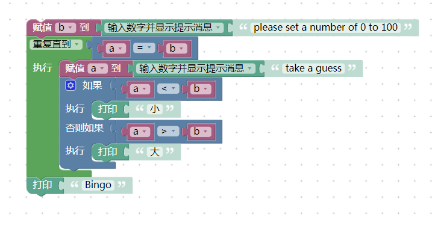
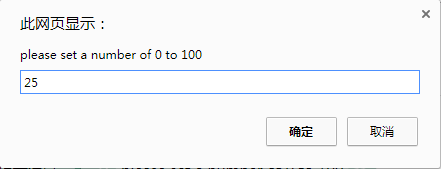
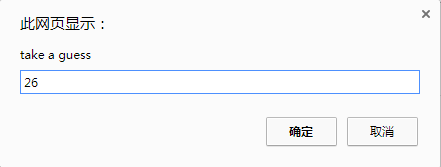
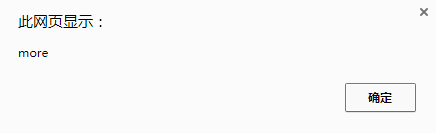
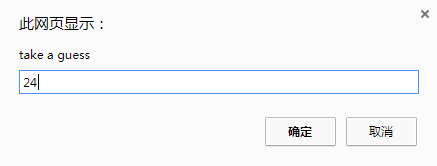
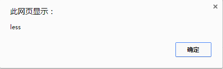
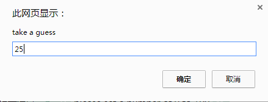
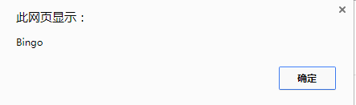

#个人案例汇总
---
##项磊磊
####案例名称：猜猜看是几？

这是一个游戏的案例，在平常我们聚会时，我们通常会玩一个游戏：首先，一个人输入一个数字，大家一块去猜，如果数字小了，那么主持人就会提示小了；如果数字大了，那么主持人提示大了。直到我们猜中这个数字。
这就是这样一个案例，首先展示下它的拼接好的模块图  
  
下面来运行。首先，我们设定一个数字25  
  
我们来猜26  
  
结果呢？多了。  
  
我们再猜24  
  
结果少了  
  
最后，我们输入25  
  
来看看  
  
答案正确了。所以下次和朋友聚餐时，可以玩一下试试。  

####JavaScript码
var a, b;  

b = window.prompt('请设定数字');  
while (!(a == b)) {  
  a = parseFloat(window.prompt('猜猜看'));  
  if (a < b) {  
    window.alert('小');  
  } else if (a > b) {  
    window.alert('大');  
  }  
}  
window.alert('Bingo');  

####XML代码
<xml xmlns="http://www.w3.org/1999/xhtml">
  <variables>
    <variable type="" id="SM2_RJEIkiMTOE$kpPcA">a</variable>
    <variable type="" id="5IM(6tU44P%,W!zdb:~$">b</variable>
  </variables>
  <block type="variables_set" id="$)yY@y/rRKpfvWGc!rV@" x="163" y="63">
    <field name="VAR" id="5IM(6tU44P%,W!zdb:~$" variabletype="">b</field>
    <value name="VALUE">
      <block type="text_prompt_ext" id="~eCmk.72eyu!cpu-Sf,O">
        <mutation type="TEXT"></mutation>
        <field name="TYPE">TEXT</field>
        <value name="TEXT">
          <shadow type="text" id="qu3Pt2A(5OH=qf{fVd]Y">
            <field name="TEXT">please set a number of 0 to 100</field>
          </shadow>
        </value>
      </block>
    </value>
    <next>
      <block type="controls_whileUntil" id=";==W__o~(1}TP=uz2PqQ">
        <field name="MODE">UNTIL</field>
        <value name="BOOL">
          <block type="logic_compare" id="@){N_!!-!K(ZL(pWEz$b">
            <field name="OP">EQ</field>
            <value name="A">
              <block type="variables_get" id="`,k/r:`$MN5^Fakj4ty!">
                <field name="VAR" id="SM2_RJEIkiMTOE$kpPcA" variabletype="">a</field>
              </block>
            </value>
            <value name="B">
              <block type="variables_get" id="zkwic?GKfYtA}Bba]BCS">
                <field name="VAR" id="5IM(6tU44P%,W!zdb:~$" variabletype="">b</field>
              </block>
            </value>
          </block>
        </value>
        <statement name="DO">
          <block type="variables_set" id="qfR:wN_.I)JFYPpq`y]/">
            <field name="VAR" id="SM2_RJEIkiMTOE$kpPcA" variabletype="">a</field>
            <value name="VALUE">
              <block type="text_prompt_ext" id="H.5Wkd5IIzzil4Jm$5_p">
                <mutation type="TEXT"></mutation>
                <field name="TYPE">TEXT</field>
                <value name="TEXT">
                  <shadow type="text" id="s}^))-7B82^RrF)`}^H@">
                    <field name="TEXT">take a guess</field>
                  </shadow>
                </value>
              </block>
            </value>
            <next>
              <block type="controls_if" id="5K]lTHT=D9WHtrVp[_LY">
                <mutation elseif="1"></mutation>
                <value name="IF0">
                  <block type="logic_compare" id="ZYoKfLLaqyTjPAgc3s1(">
                    <field name="OP">LT</field>
                    <value name="A">
                      <block type="variables_get" id="q@KTUdRh}.JD25?8f#`B">
                        <field name="VAR" id="SM2_RJEIkiMTOE$kpPcA" variabletype="">a</field>
                      </block>
                    </value>
                    <value name="B">
                      <block type="variables_get" id="XX5vnzEcKFHUFJi`;Quh">
                        <field name="VAR" id="5IM(6tU44P%,W!zdb:~$" variabletype="">b</field>
                      </block>
                    </value>
                  </block>
                </value>
                <statement name="DO0">
                  <block type="text_print" id="d#EG6jTQt^RE4VkM|%`W">
                    <value name="TEXT">
                      <shadow type="text" id="E!XiSmx(sMIj*!pBC.Xz">
                        <field name="TEXT">less</field>
                      </shadow>
                    </value>
                  </block>
                </statement>
                <value name="IF1">
                  <block type="logic_compare" id="Q%`;W.mu,@uxBGrf],+?">
                    <field name="OP">GT</field>
                    <value name="A">
                      <block type="variables_get" id="Yq}Imn6RsWHU,%N,TW!c">
                        <field name="VAR" id="SM2_RJEIkiMTOE$kpPcA" variabletype="">a</field>
                      </block>
                    </value>
                    <value name="B">
                      <block type="variables_get" id="fF|{t`~G@;F;9%ulS+]7">
                        <field name="VAR" id="5IM(6tU44P%,W!zdb:~$" variabletype="">b</field>
                      </block>
                    </value>
                  </block>
                </value>
                <statement name="DO1">
                  <block type="text_print" id="#O$LEi,bljpRU,P!^G_H">
                    <value name="TEXT">
                      <shadow type="text" id="PL9AF-*XiRlGcdU=W(Kp">
                        <field name="TEXT">more</field>
                      </shadow>
                    </value>
                  </block>
                </statement>
              </block>
            </next>
          </block>
        </statement>
        <next>
          <block type="text_print" id="6#hP,WEbP;;Ocv0!;N??">
            <value name="TEXT">
              <shadow type="text" id="^`#h|n^PFddlRTfg`[v|">
                <field name="TEXT">Bingo</field>
              </shadow>
            </value>
          </block>
        </next>
      </block>
    </next>
  </block>
</xml>

